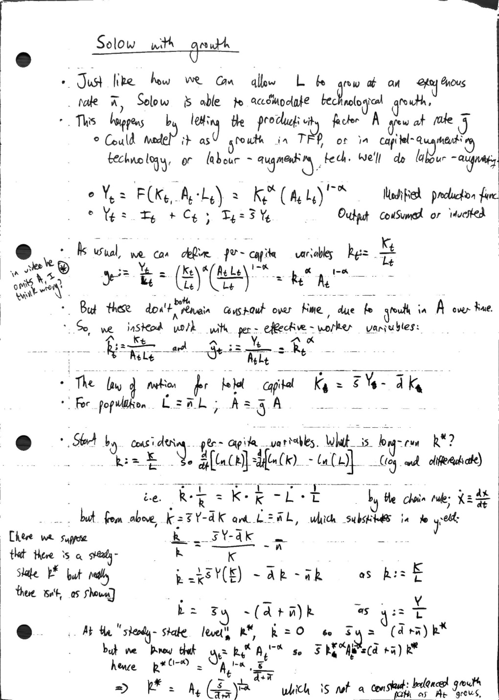
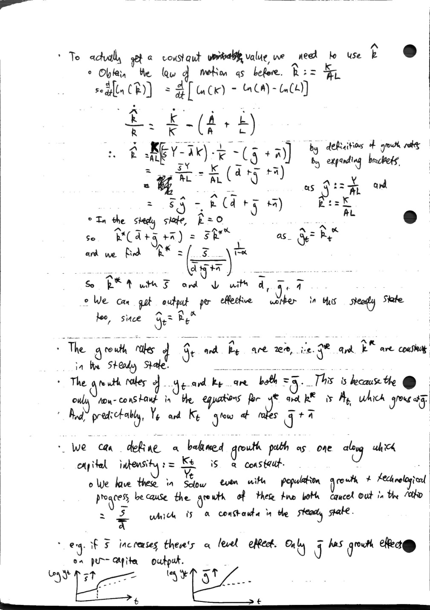

# 1.3a - Solow with growth

Created: 2024-02-26 23:03:25 +0000

Modified: 2024-02-27 09:48:26 +0000

---

-   [EconomiCurtis - Solow Growth Model - Videos](https://sites.google.com/site/economicurtis/a-course-in-intermediate-macroeconomics/solow-growth-model-videos?authuser=0)
-   [Dynamics in the Solow-Swan Growth Model - Wolfram Demonstrations Project](https://demonstrations.wolfram.com/DynamicsInTheSolowSwanGrowthModel/)

