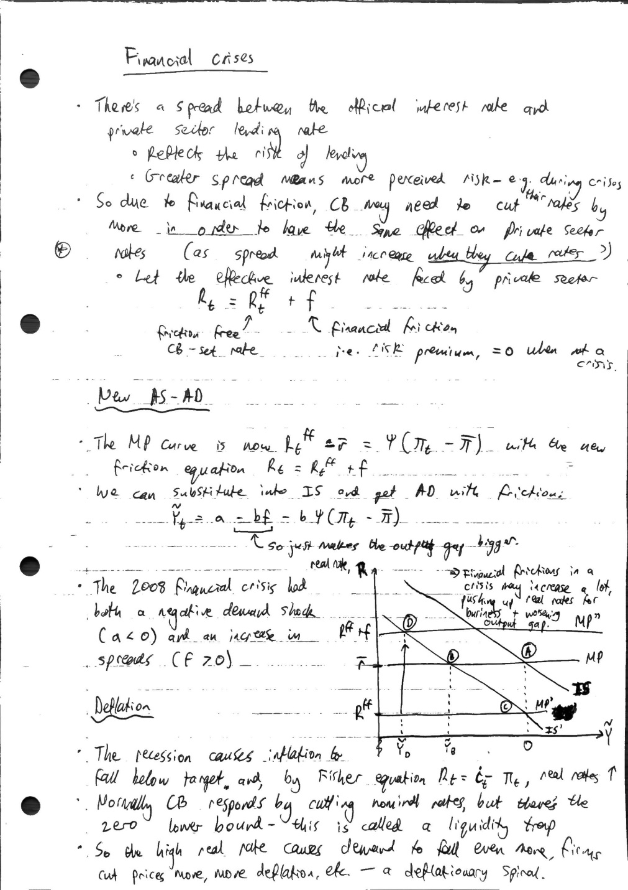
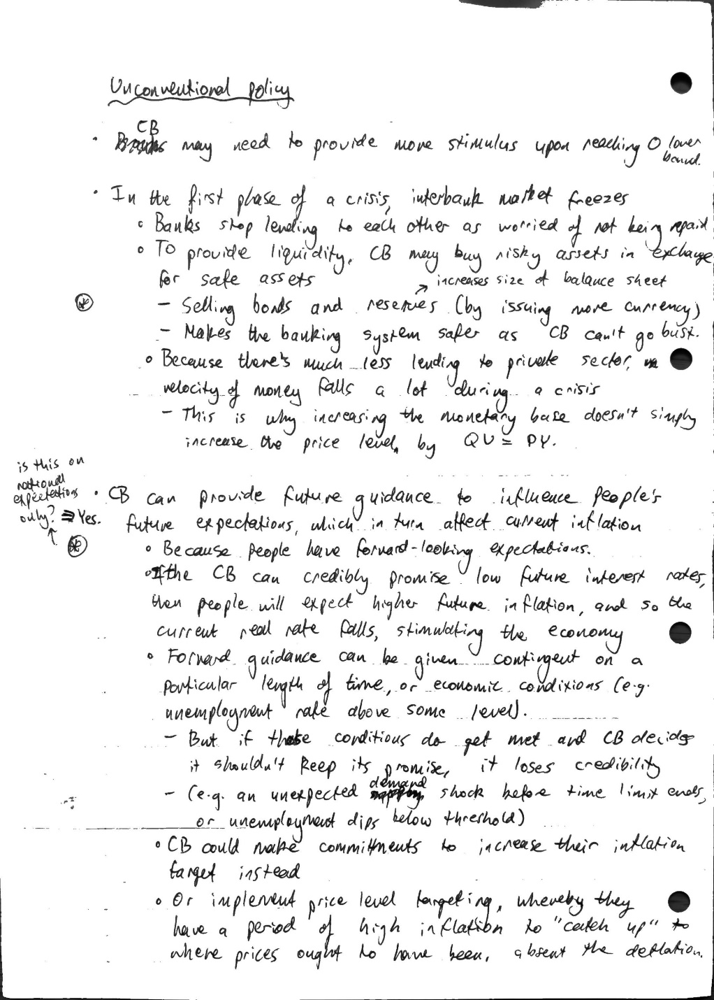
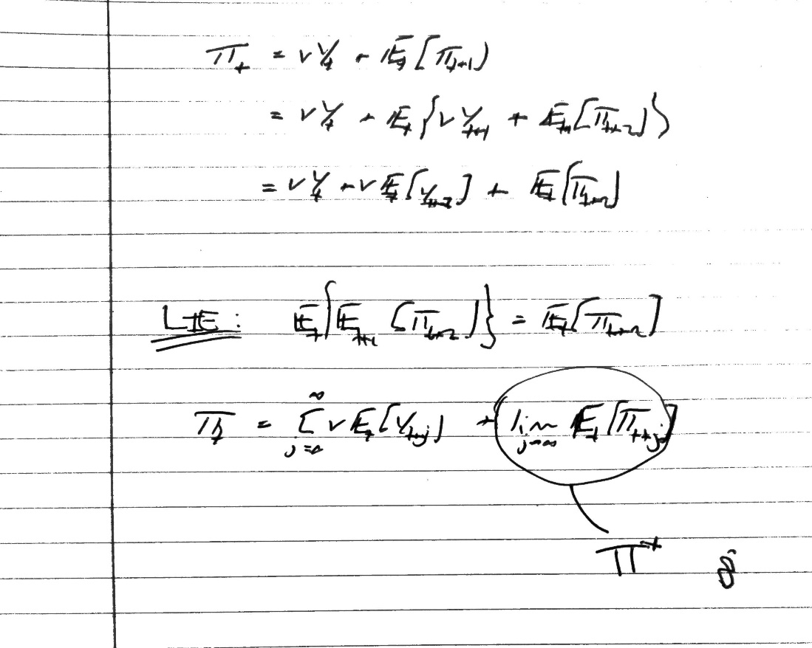

# 7.1 - financial crises

Created: 2024-02-26 10:55:46 +0000

Modified: 2024-03-10 21:06:30 +0000

---

<<[lecture_16-1.pdf](../../media/lecture_16-1.pdf)>>

Law of iterated expectations and forward guidance:

This circled expression is called the "bubble term"

