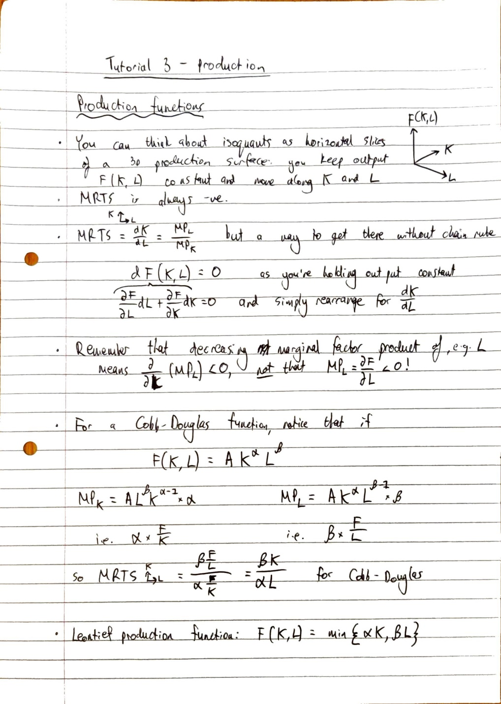
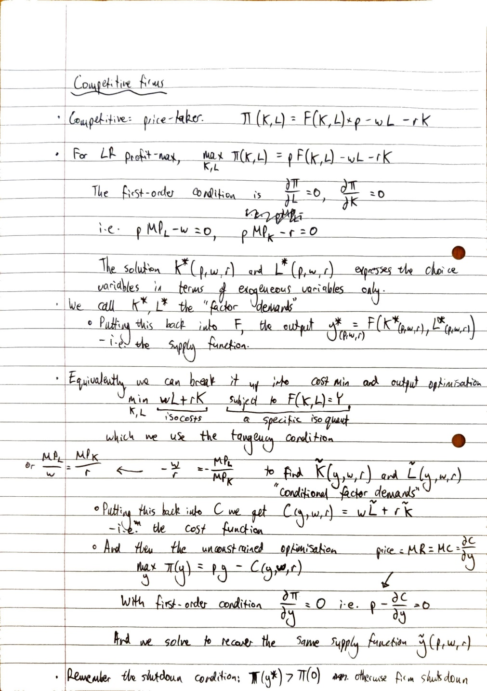
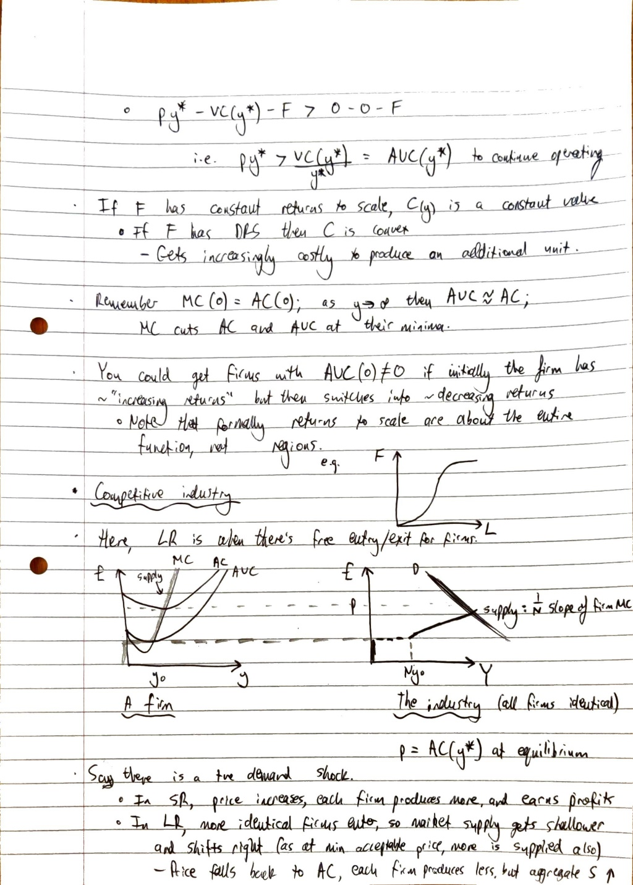

# 3 - production

Created: 2023-11-02 15:23:56 +0000

Modified: 2024-05-27 10:59:10 +0100

---

Note - there's an error in the next page. Where it says 
that constant returns to scale mean that $C(y)$ is a constant
value, it should read that CRS mean that $MC(y)$ is a constant
value.

