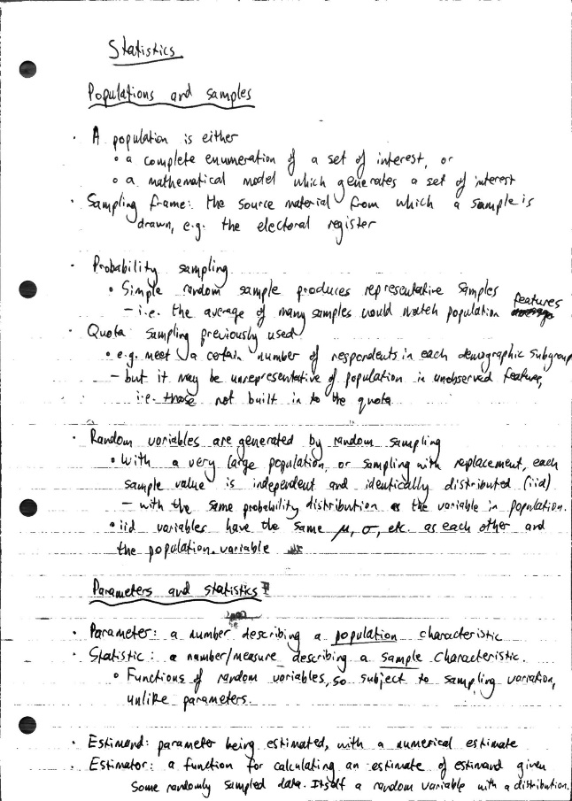
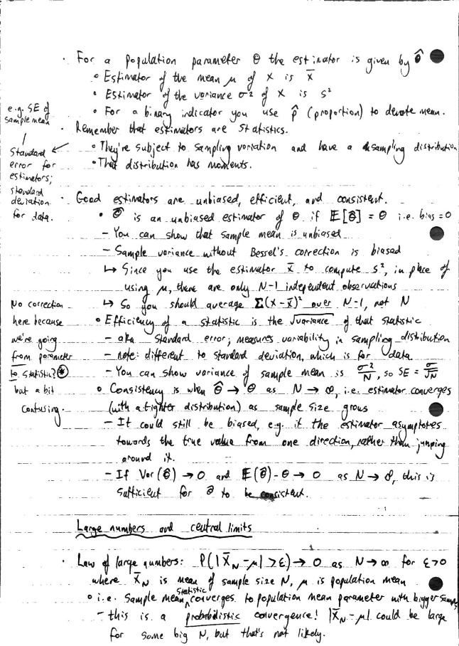
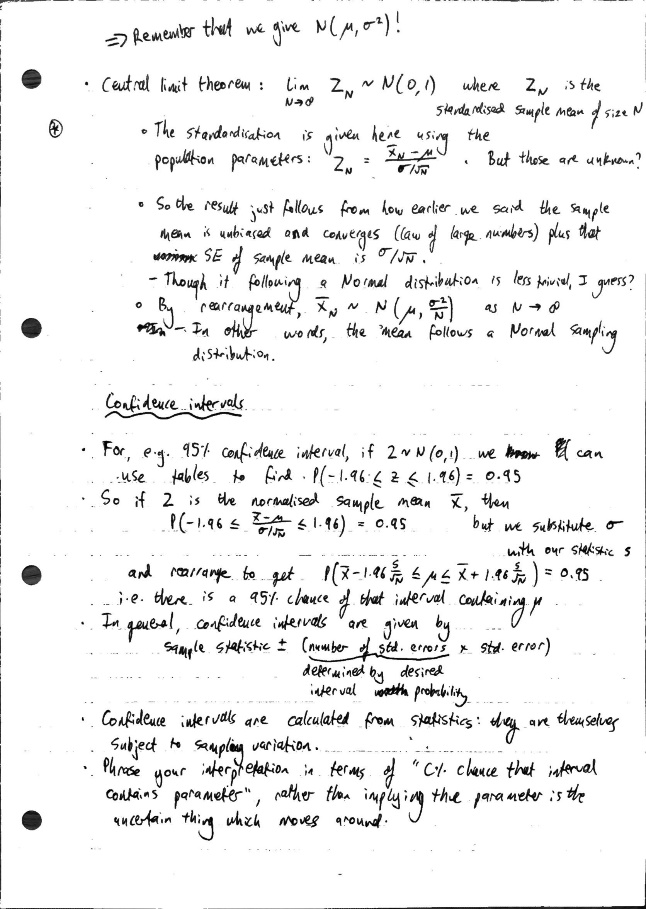
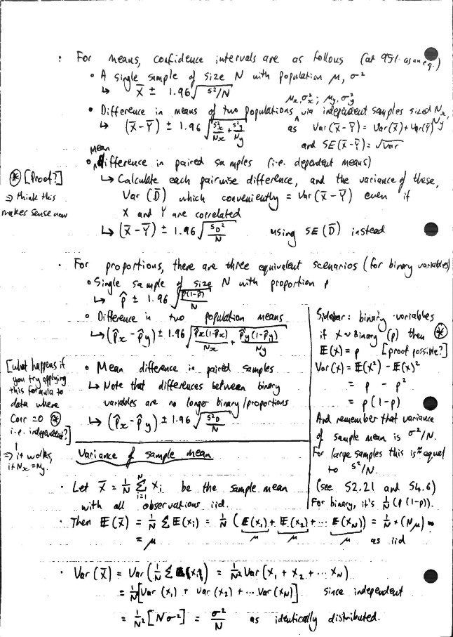
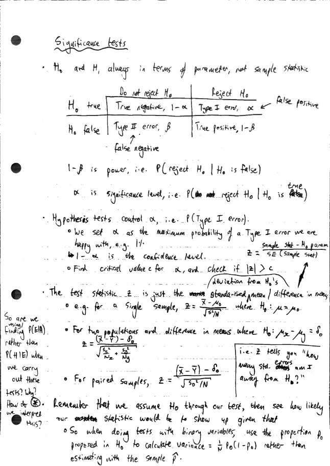
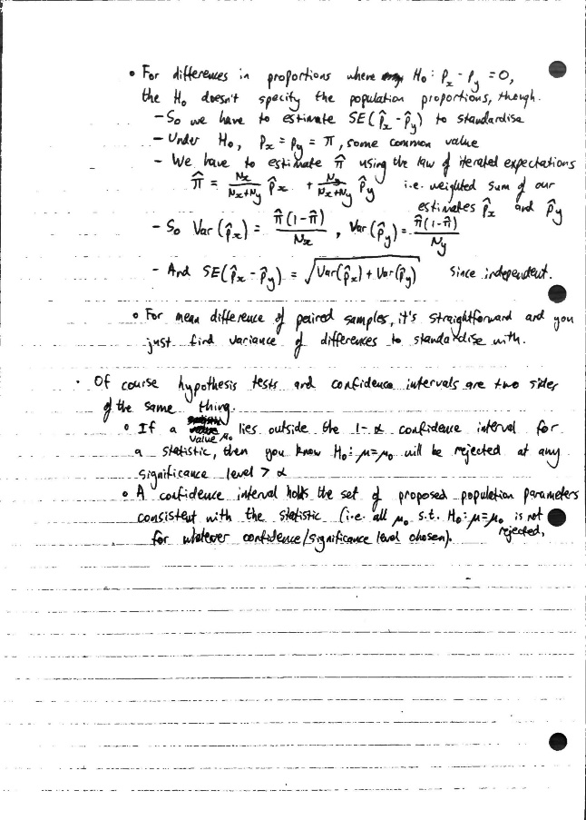
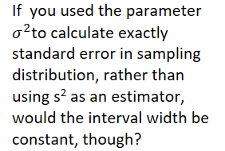

# 4 - statistics

Created: 2023-12-04 18:42:51 +0000

Modified: 2024-06-14 19:01:17 +0100

---

<<[S1.Populations.and.Samples.pdf](../../media/S1.Populations.and.Samples.pdf)>><<[S4.Intro.to.Statistical.Inference.pdf](../../media/S4.Intro.to.Statistical.Inference.pdf)>><<[S6.Hypothesis.Testing.pdf](../../media/S6.Hypothesis.Testing.pdf)>><<[S2.Parameters.Statistics.and.Estimation.pdf](../../media/S2.Parameters.Statistics.and.Estimation.pdf)>><<[S5.Confidence.Intervals.pdf](../../media/S5.Confidence.Intervals.pdf)>><<[S6a.Hypothesis.Tests.for.Means.pdf](../../media/S6a.Hypothesis.Tests.for.Means.pdf)>><<[S3.LLN.and.CLT.pdf](../../media/S3.LLN.and.CLT.pdf)>><<[S5a.Confidence.Intervals.for.Means.pdf](../../media/S5a.Confidence.Intervals.for.Means.pdf)>><<[S6b.Hypothesis.Tests.for.Proportions.pdf](../../media/S6b.Hypothesis.Tests.for.Proportions.pdf)>><<[S5b.Confidence.Intervals.for.Proportions.pdf](../../media/S5b.Confidence.Intervals.for.Proportions.pdf)>><<[S7.Hypothesis.Tests.and_Confidence_Intervals.pdf](../../media/S7.Hypothesis.Tests.and_Confidence_Intervals.pdf)>>

Variance of sample is different to sample mean variance!

It approx. holds when using s^2^~.~ But wouldn't you also need to use the mean estimator rather than parameter?

Ahh - for hypothesis tests you use the parameter proposed by H~0~

i.e. because they are centred around the sample statistic.

Like in the single mean case, you plug in s^2^ in place of the nuisance parameter for population variance

