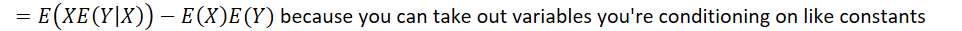

# 1 - probability, variables, moments

Created: 2023-11-24 16:35:06 +0000

Modified: 2024-03-07 10:28:53 +0000

---

<<[Class-quiz-1.pdf](../../media/Class-quiz-1.pdf)>>

-   Law of the unconscious statistician
-   
-   
    -   Note that variance is not identical to the 2nd moment of X
-   
    -   

-   Cool thing about area above the CDF is the expectation ( <https://math.stackexchange.com/questions/3128271/what-is-the-integral-of-a-cumulative-distribution-function#3128332>)
    -   Works nicely for discrete variables too

-   
    -   
-   
    -   
    -   

-   
-   Note that while the sum of two Normal distributions is also Normal, this is not true in general
    -   e.g. sum of two uniform distributions gives you an upturned triangle shape (think about sum of two die rolls, but just made continuous)

-   
    -   We can show the second implication as follows:
        -   
        -   
        -   
        -   
        -   

