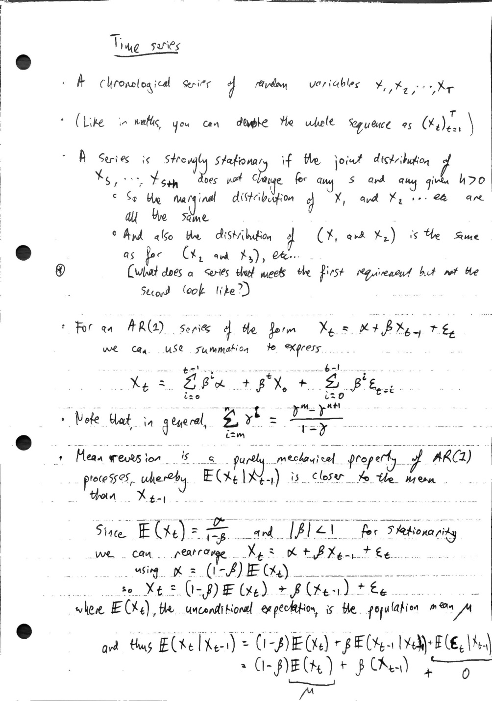

# 6 - time series

Created: 2024-02-29 15:15:09 +0000

Modified: 2024-02-29 16:20:06 +0000

---

### An Example: A Time Series with Changing Dependence Structure

**Time Series Construction:**

Consider a time series ({X_t}) generated as follows:

1. For each (t), let (X_t = Y_t + Z_t), where (Y_t) and (Z_t) are independent random variables.

2. (Y_t) follows a distribution (D) (for example, Normal(0,1)) that does not change over time.

3. (Z_t) is a binary random variable where (Z_t in {0, a_t}), with (P(Z_t = a_t) = p) and (P(Z_t = 0) = 1-p). The value (a_t) changes over time in a deterministic way (e.g., (a_t = sin(t)) or a periodic function that changes its amplitude or frequency over time).

**First-order Stationarity:**

- The series ({X_t}) has first-order stationarity if the marginal distribution of each (X_t) remains constant over time. This is true if the distribution of (Y_t) does not change and if the distribution of (Z_t) in terms of probability (p) does not change, although the specific outcome (a_t) for (Z_t) changes. This implies that the mean and variance of (X_t) could remain constant if designed appropriately (e.g., if the mean and variance of (Z_t) are constant over time).

**Changing Joint Distributions:**

- The joint distribution of ((X_t, X_{t+k})) can change over time even if the marginal distributions do not, due to the changing relationship introduced by (Z_t)'s changing nature (e.g., (a_t)). This can affect the correlation structure or the way (X_t) is related to (X_{t+k}) over different time lags (k). For instance, if (a_t) introduces a periodic or cyclical component that affects (X_t), the correlation between (X_t) and (X_{t+k}) could change depending on how (a_t) evolves over time, introducing non-stationarity in higher-order moments or distributions.

**Conclusion:**

This example illustrates a time series where each (X_t) adheres to the same marginal distribution due to the stationary nature of (Y_t) and the consistent probabilistic behavior of (Z_t), despite (Z_t)'s outcomes changing deterministically over time. However, the joint distributions of (X_t) and (X_{t+k}) can vary due to the changing influence of (Z_t), demonstrating first-order stationarity without stricter stationarity due to the evolving dependence structure.

