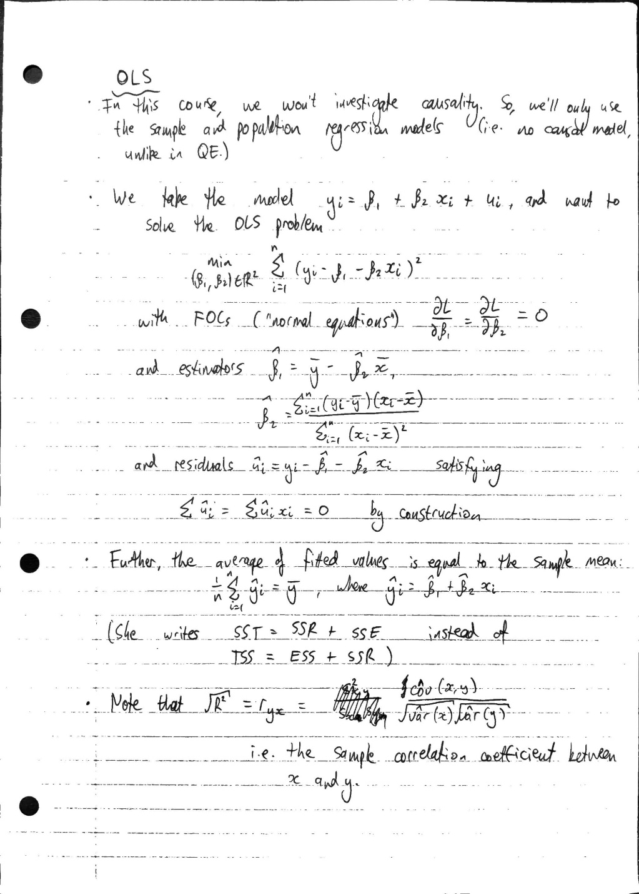
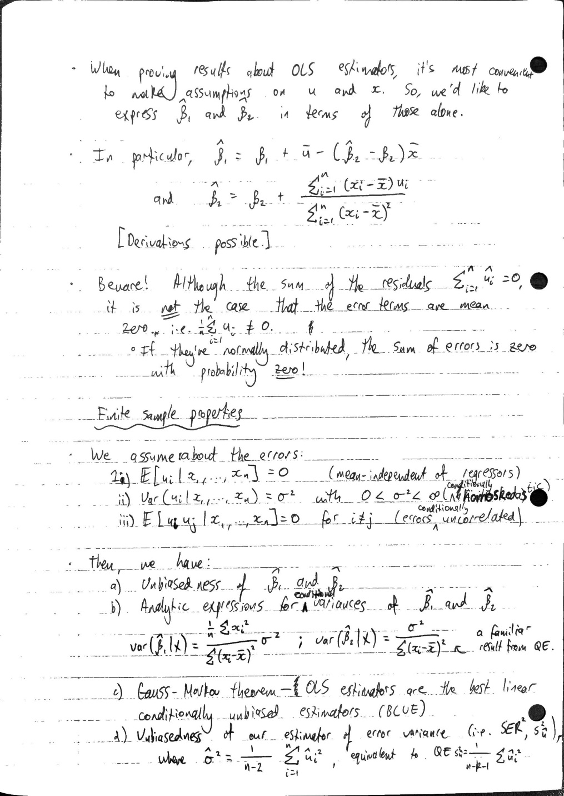
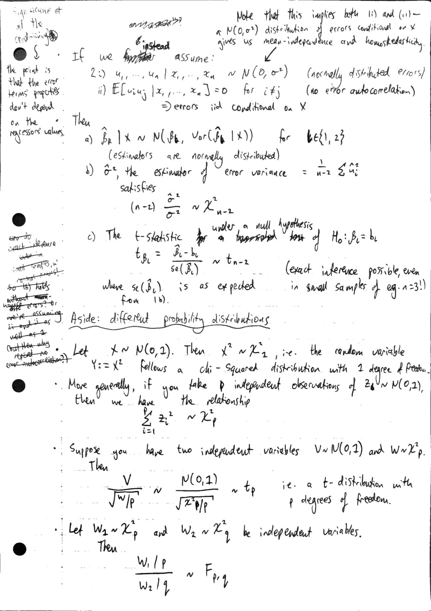
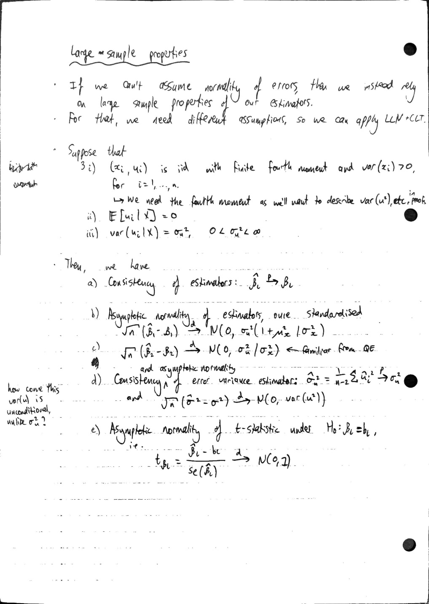
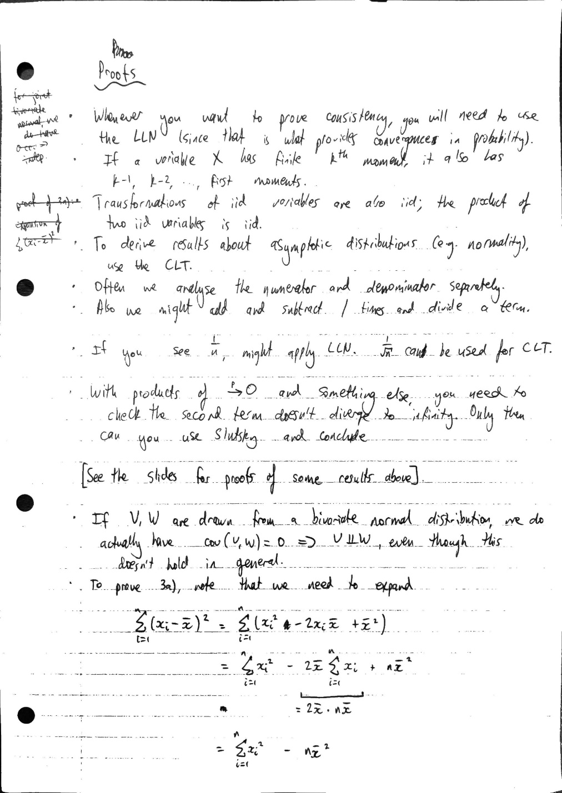
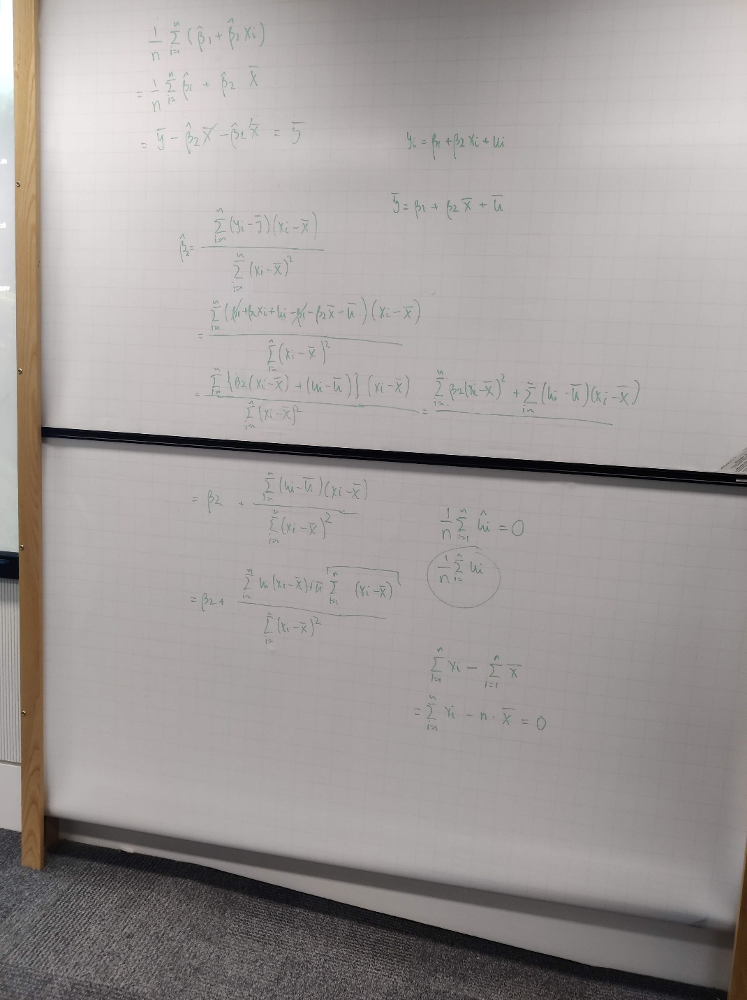
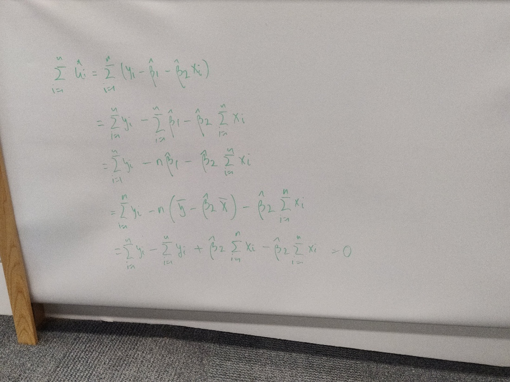

# 1.2 - simple OLS properties

Created: 2025-10-15 11:49:31 +0100

Modified: 2026-01-13 11:01:21 +0000

---

**Derivation of formula for the slope estimator hat beta_2 in slope + intercept regression**

**Proof that the OLS residuals sum to zero**

