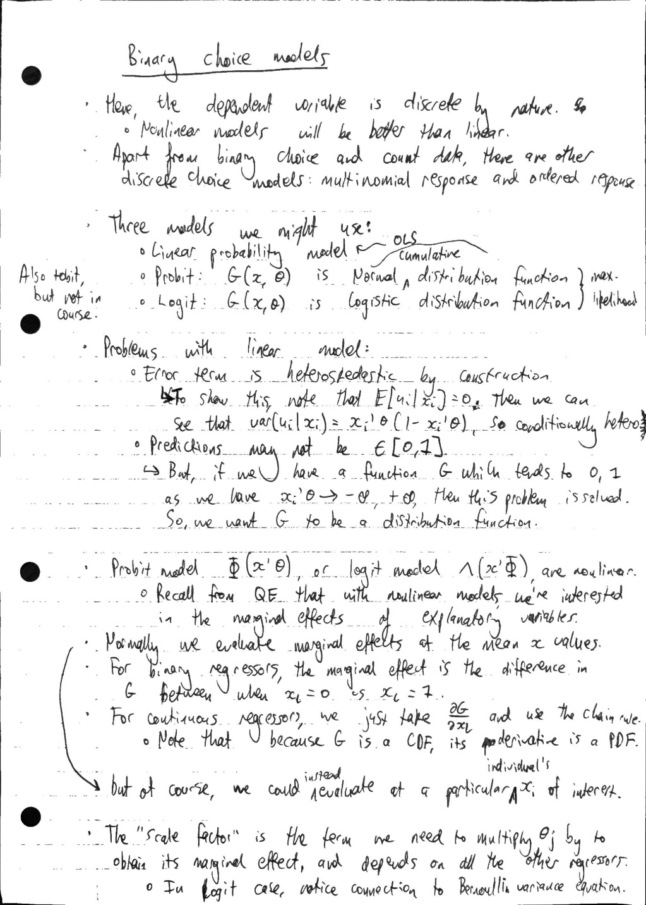
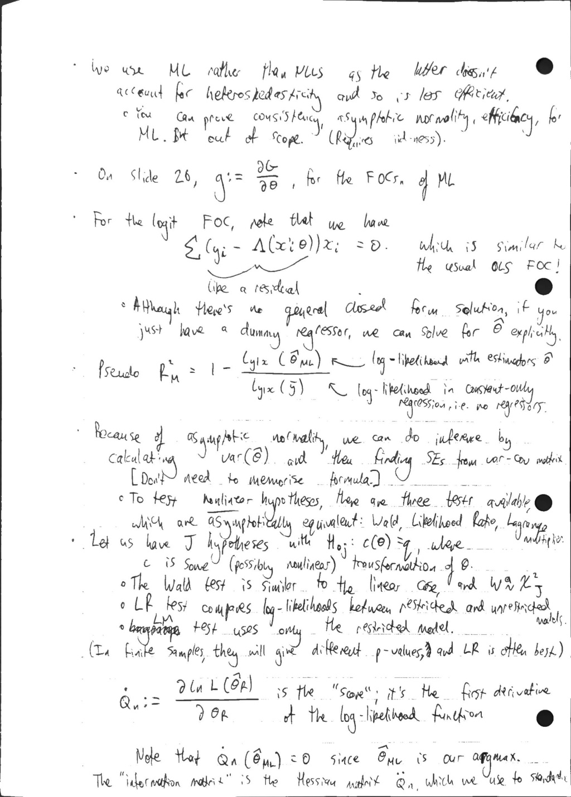
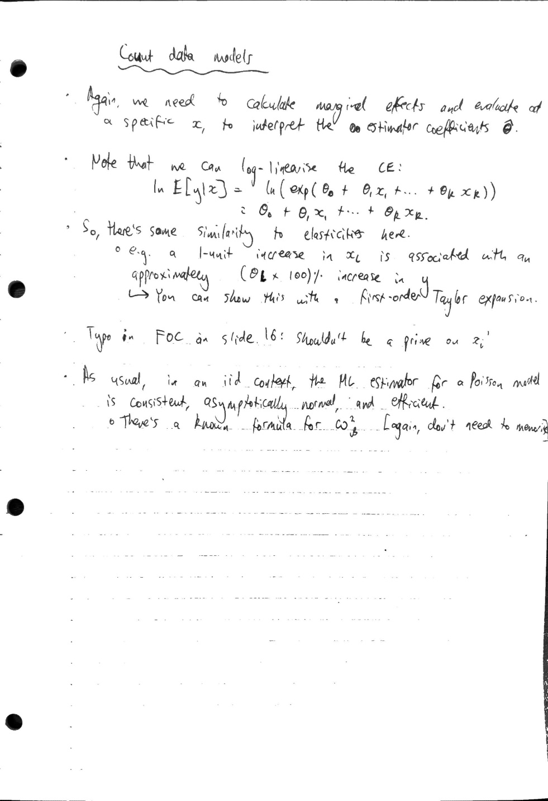

# 4.2 - discrete models

Created: 2025-11-05 15:16:24 +0000

Modified: 2026-01-11 11:48:10 +0000

---

See [Claude](https://claude.ai/chat/bbbc819b-c79f-468a-b56e-8f2e7d403f7f) on the connection between LM test as presented in the slides and Lagrange multipliers from constrained optimisation.

