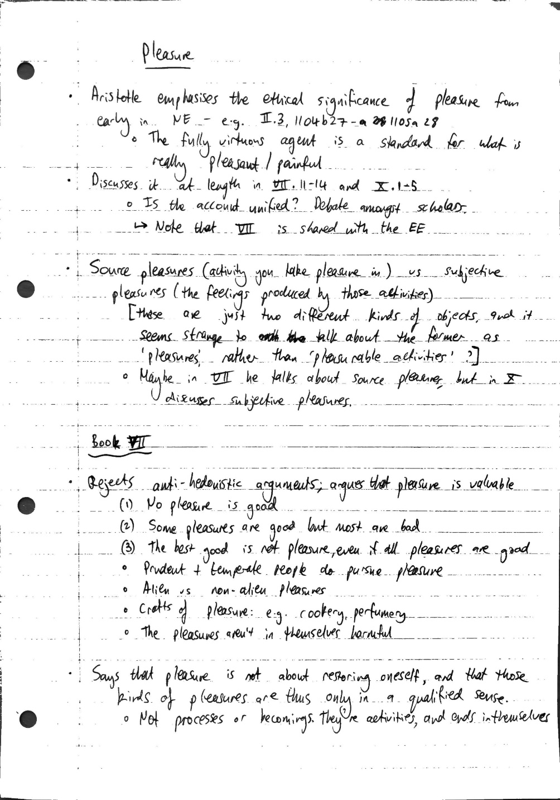
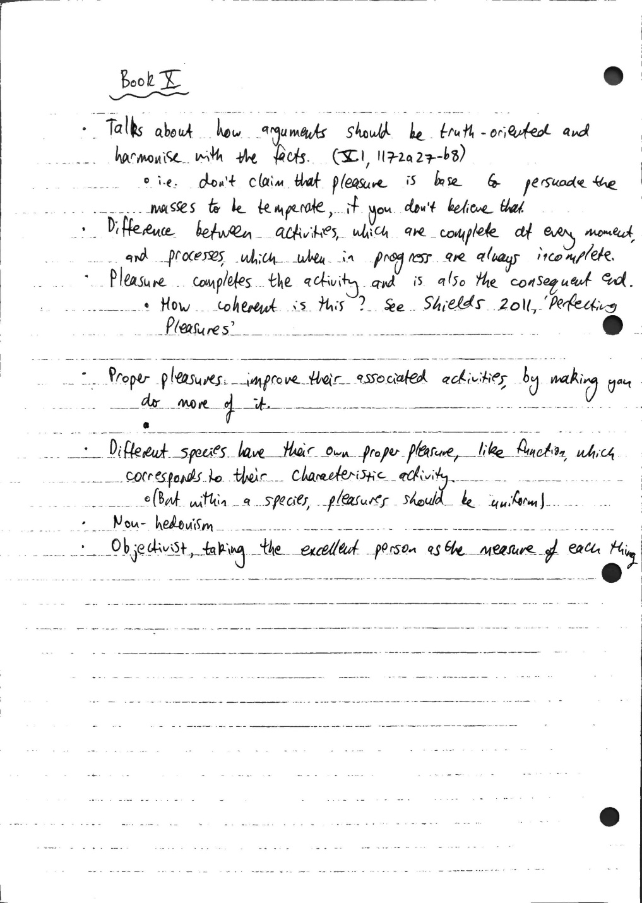

# 13 - pleasure

Created: 2025-03-03 16:48:59 +0000

Modified: 2025-03-21 15:12:50 +0000

---

<<[Aristotle-NE-Lecture-13.pdf](../../media/Aristotle-NE-Lecture-13.pdf)>>

--> Remember the context of Greek philosophy: Aristotle positioning himself between hedonists and anti-hedonists.

